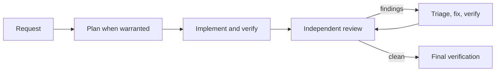

# Nono Skills

[](https://github.com/nono911/nono-skills/actions/workflows/ci.yml)
[](https://www.npmjs.com/package/nono-skills)
[](https://github.com/nono911/nono-skills/blob/main/LICENSE)
[](#skills)

A reusable software-engineering skill pack for Codex and other Agent Skills hosts. It gives capable coding agents concise intent, evidence requirements, and escalation rules without forcing every task through a large workflow.

> **Project status:** experimental (`0.x`). Pin exact versions in repeatable setups and review release notes before updating.

## Quick start

- **Using Codex?** Install the native plugin: `npx nono-skills install`
- **Using Claude Code, Cursor, Windsurf, Kiro, OpenCode, Gemini CLI, or another Agent Skills host?** Use the universal installer: `npx skills@latest add nono911/nono-skills`

Choose one installation path for the same host and scope to avoid duplicate skill names.

## Requirements

- Node.js 20 or newer for the native installer and `nono-skills` maintenance CLI.
- A Codex release with plugin support for native installation, or a host supported by the open [`skills` CLI](https://github.com/vercel-labs/skills) for universal installation.

## Why Nono Skills

Standalone prompts and small skill collections are often enough for focused tasks. Nono Skills is for work that also benefits from shared engineering intent, explicit human escalation, independently reviewed changes, and bounded review-fix execution.

The 18 ordinary skills remain lightweight and model-directed. The two managed loops activate only when explicitly requested, require consent for isolation and commits, and preserve structured local evidence. If you need only one checklist, a smaller standalone skill may be the better choice.

## What it provides

- 20 focused skills spanning discovery, implementation, review, testing, communication, handoff, design, migration, QA, and release readiness.
- `delivery-loop` for features and `bugfix-loop` for proven defects.
- Native Codex packaging under the `engineering` namespace and portable Agent Skills folders.
- Deterministic contract validation plus paired black-box scenarios for measuring host behavior and workflow overhead.



## Install

### Native Codex plugin

```bash
npx nono-skills@0.15.0 install
```

Start a new Codex task after installation or update. Skills appear as `$engineering:<name>`. Optional repository scaffolding is available through `npx nono-skills init`; existing differing files are not overwritten unless `--force` is explicit.

### Universal Agent Skills

```bash
npx skills@latest add nono911/nono-skills
```

Select the skills, agents, scope, and copy or symlink mode interactively. Install the complete pack when using either managed loop so every companion skill is available.

## Host support

| Host group | Installation | Evidence published by this project |
|---|---|---|
| Codex | Native plugin or universal | Installer, package contracts, OS/Node CI matrix, and a bundled black-box adapter |
| Claude Code, Cursor, Windsurf, Kiro, OpenCode, Gemini CLI | Universal | Installation targets provided by the open `skills` CLI; no Nono Skills behavioral scorecard published yet |
| Other Agent Skills hosts | Universal when listed by `skills` | Compatibility depends on the host; untested here unless a versioned scorecard is published |

Portable installation is not a claim that every host activates or follows skills identically. See [development and evaluation policy](https://github.com/nono911/nono-skills/blob/main/docs/development.md) for the evidence required before a host is promoted to behavior-tested.

## Use

For ordinary work, ask naturally:

```text
Implement user authentication and verify the affected behavior.
```

Communication can activate when explaining or shaping human-readable work is the primary task. Handoff remains explicit:

```text
$engineering:communicate-clearly
Turn this release status into a concise stakeholder update.

$engineering:handoff
Prepare a continuation packet for the next agent; do not write files.
```

Invoke a managed loop explicitly when you want approved worktree isolation, bounded sequential review, and verified remediation:

```text
$engineering:delivery-loop

Add booking cancellation. Only the owner may cancel, started bookings cannot
be cancelled, and unknown bookings return not found. Add regression tests.
Do not push.
```

Universal installations use the skill names shown by their host; do not assume the Codex `$engineering:` prefix. Native subagents are the default. External or Hybrid execution requires explicit selection and per-run consent.

## What the output looks like

The packaged corpus can be checked without making a model call:

```console
$ npx nono-skills eval
Validated 100 behavioral cases across 20 skills and 5 categories.
This validates the corpus only. Use eval cases with a host adapter, then eval score on captured results.
```

A completed managed run writes a redacted `summary.json` outside tracked source. Its stable shape includes the outcome, consumed budgets, review observations, and residual findings:

```json
{
  "outcome": "COMPLETE",
  "completion_kind": "clean_with_residuals",
  "budgets_used": { "review_batches": 2, "fix_cycles": 1, "no_verdict_retries": 0 },
  "residual_findings": [
    {
      "id": "REVIEW-3", "severity": "low", "category": "maintainability",
      "location": "src/parser.js", "disposition": "non-blocking",
      "reason_code": "LOW_SEVERITY"
    }
  ]
}
```

## Skills

| Intent | Skill |
|---|---|
| Explore a product or technical direction | `brainstorm` |
| Turn defined work into acceptance-linked steps | `plan` |
| Build a general software change | `implement` |
| Explain, summarize, report, or shape human-readable work items | `communicate-clearly` |
| Prepare a safe continuation packet for another owner | `handoff` |
| Review a diff without editing it | `review` |
| Correct validated findings | `fix-findings` |
| QA a runnable user journey without changing source | `acceptance-verify` |
| Deliver a feature through bounded review | `delivery-loop` |
| Prove and fix an existing defect | `bugfix-loop` |
| Find a runtime root cause | `debug` |
| Add focused behavioral or regression tests | `test` |
| Review security as the primary objective | `security-review` |
| Review architecture and change cost | `architecture-review` |
| Improve structure without changing behavior | `refactor` |
| Check readiness without releasing | `release-readiness` |
| Estimate effort and uncertainty | `estimate` |
| Design a reversible transition | `migration` |
| Design a stable consumer contract | `api-design` |
| Design persistent data around invariants | `database-design` |

## Assurance and loop limits

| Layer | Guarantee |
|---|---|
| Skill text | Model-interpreted guidance; activation and compliance are host-dependent. |
| Loop controller | Validates transitions, fixed budgets, exact-HEAD leases, evidence, dispositions, and residual completion after a managed run starts. |
| Evidence records | Local, snapshot-bound, and hash-chained for tamper evidence. They are not tamper-proof and are not a security boundary. |
| Evaluation | Measures asserted corpus boundaries; it does not prove identical behavior on every host. |

The controller cannot force a model to activate a skill or call the controller. Reviewer independence and supplied evidence still depend on the host and execution environment.

Review is sequential, not five reviews launched at once: `review HEAD -> triage -> fix -> verify -> review new HEAD`. One run permits at most five review batches, four fix cycles, and one no-verdict retry. See [assurance boundaries](https://github.com/nono911/nono-skills/blob/main/docs/assurance.md) and [engineering loops](https://github.com/nono911/nono-skills/blob/main/docs/engineering-loops.md).

## Maintenance

```bash
npx nono-skills doctor
npx nono-skills agents doctor
npx nono-skills eval
npx nono-skills update
npx nono-skills uninstall
```

Inspect managed evidence with `npx nono-skills runs list`, `npx nono-skills runs show <run-id>`, and `npx nono-skills runs supersede <legacy-run-id> --confirm`. Universal installations use `npx skills list`, `npx skills update`, and `npx skills remove`.

## Documentation and contributing

Recommended reading order:

1. [Installation and maintenance](https://github.com/nono911/nono-skills/blob/main/docs/installation.md)
2. [Delivery and bugfix loops](https://github.com/nono911/nono-skills/blob/main/docs/engineering-loops.md)
3. [Assurance boundaries](https://github.com/nono911/nono-skills/blob/main/docs/assurance.md)
4. [Development and evaluation](https://github.com/nono911/nono-skills/blob/main/docs/development.md)
5. [Changelog](https://github.com/nono911/nono-skills/blob/main/CHANGELOG.md)

Report defects or propose changes through [GitHub Issues](https://github.com/nono911/nono-skills/issues). See [CONTRIBUTING.md](https://github.com/nono911/nono-skills/blob/main/CONTRIBUTING.md) before opening a pull request.

## License

[MIT](https://github.com/nono911/nono-skills/blob/main/LICENSE)
